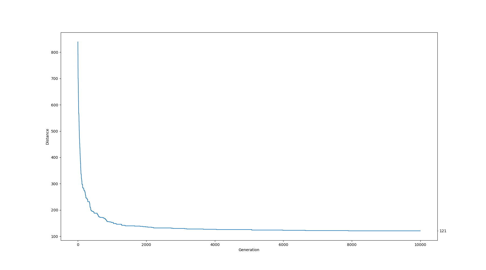

# Projekt z Podstaw Sztucznej Inteligencji - przeszukiwanie
## MM.AE2 Problem komiwojarzera - algorytm ewolucyjny

### 1. Treść zadania

Rozwiązanie powinno opierać się na wybranym algorytmie ewolucyjnym z pewnym modelem osobników oraz odpowiednio 
zaimplementowanymi operacjami krzyżowania i mutacji. Sensownie przedstawić postęp w działaniu algorytmu 
(np. Wypisując kluczowe informacje diagnostyczne). WE: plik z definicją mapy/grafu, WY: najkrótszy cykl łączący punkty.

### 2. Przyjęte założenia, doprecyzowanie treści

- Nie rozróżniamy pojęcia kosztu przejazdu i odległości między miastami
- Graf wejściowy nie musi być pełny
- Ponieważ graf wejściowy nie jest pełny cykl łączący wszystkie
wierzchołki może nie istnieć
- Graf wejściowy zawiera odległości między miastami
- Zadaniem algorytmu jest minimalizowanie długości cykli w grafie
- Algorytm działa określoną liczbę iteracji (tzw. generacji), po
czym zwraca najlepszy znaleziony wynik lub wiadomość o braku cyklu

### 3. Podział pracy

Rafał Babinski:

- Klasa Graph
- Selekcja osobników
- Mutacja osobników
- Inicjalizacja populacji
- Główna pętla algorytmu
- Wyjście

Roman Moskalenko:

- Organizacja projektu
- Generator grafów
- Ocenianie osobników
- Krzyżowanie osobników
- Wejście
- Wykres odległości

### 4. Opis algorytmu/architektury

Opis znajduje się w pliku [Specyfikacja](Specyfikacja.md)

### 5. Statystyki wykonania

| Graf | Wynik | Generacje | Czas Wykonania | Wykres |
|---|---|---|---|---|
|V=10 E=36|58|2000|1s||
|V=50 E=980|92|10000|16s||
|V=100 E=4455|171|10000|1m 2s||
|V=500 E=124750|1006|1000|14m 30s||

### 6. Wnioski, możliwe usprawnienia

Algorytm znajduje coraz lepsze rozwiązania w kolejnych
generacjach, jednak zbyt mała liczba generacji nie
gwarantuje znalezienie optymalnego rozwiązania.

W przypadku grafu niepełnego algorytm na początku
ma problem ze znalezieniem cyklu spełniającego wymagania.
Możliwym usprawnieniem jest dynamiczne (w czasie działania programu) 
wybieranie liczby osobników elitarnych i współczynnika mutacji 
dla sytuacji kiedy algorytm przez dłuższy czas nie może znaleźć lepszego
rozwiązania.

### 7. Instrukcja obsługi

Main.py:
-  `-h`, `--help`  wyświetl pomoc 
-  `-n`          liczba wierzchołków
-  `-d`          gęstość grafu
-  `-s`          ustaw seed losowości
-  `-g`          liczba generacji
-  `-e`          liczba osobników elitarnych
-  `-m`          prawdopodobieństwo mutacji pojedynczego genu osobnika
-  `-i`          plik wejściowy `.json`
-  `-o`          plik wyjściowy
-  `-c`          wyświetl wykres

Przykład: wczytaj graf wejściowy z pliku input, szukaj cykli przez 1000 generacji, 
wyświetl wykres i zapisz wynik do pliku output
 
    python3 Main.py -i input -g 1000 -o output -c
    
Generator.py
-  `-h`, `--help`  wyświetl pomoc
-  `-n`          liczba wierzchołków
-  `-d`          gęstość grafu
-  `-s`          ustaw seed losowości
-  `-M`          mediana odległości
-  `-D`          wariancja odległości

Przykład: wygeneruj graf o liczbie wierzchołków 100, gęstości 0.9, medianie odległości 50,
wariancji odległości 25. Zapisz graf do pliku graph.json

    python3 Generator.py -n 100 -d 0.9 -M 50 -D 25 > graph.json
