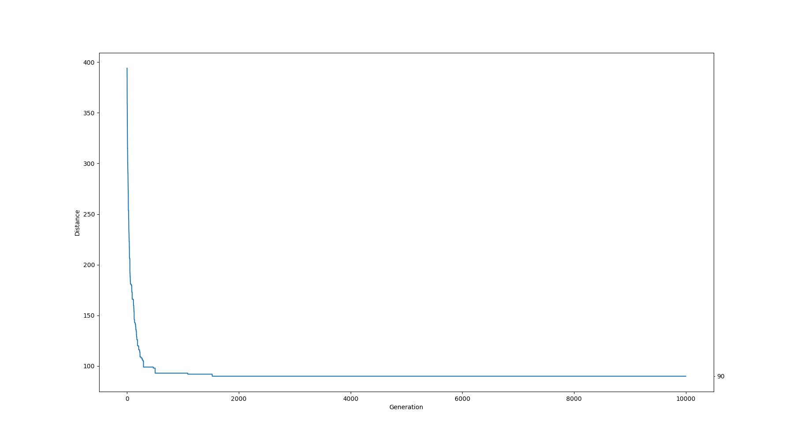

# Projekt z Podstaw Sztucznej Inteligencji - przeszukiwanie
## MM.AE2 Problem komiwojarzera - algorytm ewolucyjny

### 1. Treść zadania

Rozwiązanie powinno opierać się na wybranym algorytmie ewolucyjnym z pewnym modelem osobników oraz odpowiednio 
zaimplementowanymi operacjami krzyżowania i mutacji. Sensownie przedstawić postęp w działaniu algorytmu 
(np. Wypisując kluczowe informacje diagnostyczne). WE: plik z definicją mapy/grafu, WY: najkrótszy cykl łączący punkty.

### 2. Przyjęte założenia, doprecyzowanie treści

- Graf wejściowy nie musi być pełny
- Ponieważ graf wejściowy nie jest pełny cykl łączący wszystkie
wierzchołki może nie istnieć
- Graf wejściowy zawiera odległości między miastami
- Zadaniem algorytmu jest minimalizowanie długości cykli w grafie
- Algorytm działa określoną liczbę iteracji (tzw. generacji), po
czym zwraca najlepszy znaleziony wynik lub wiadomość o braku cyklu

### 3. Podział pracy

Rafał Babinski:

- Klasa Graph
- Selekcja osobników
- Mutacja osobników
- Inicjalizacja populacji
- Główna pętla algorytmu
- Wyjście

Roman Moskalenko:

- Organizacja projektu
- Generator grafów
- Ocenianie osobników
- Krzyżowanie osobników
- Wejście
- Wykres odległości

### 4. Opis algorytmu/architektury

Opis znajduje się w pliku Specyfikacja.md

### 5. 
| Graf | Wynik | Generacje | Wykres |
|---|---|---|---|
|V=10 E=36|58|2000||
|V=50 E=980|92|10000||
|V=100 E=4455|171|10000||
|V=500 E=124750|1006|1000||